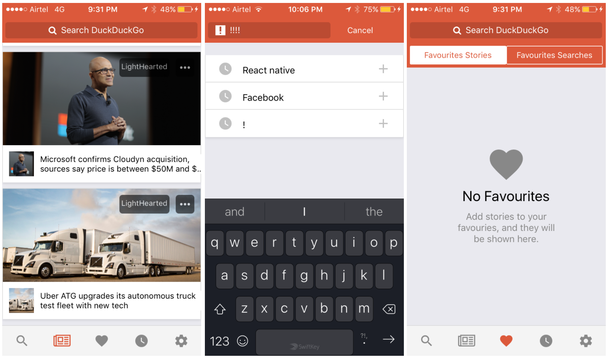

# DuckDuckGo
Unofficial DuckDuckGo app built in React Native

*Note: This is not the official DuckDuckGo application but one made by a fan. I made it only for demonstation purpose.*





### How to run the app

Please do the following to run the application.
```
git clone https://github.com/EITIAfrica/searchapp.git
cd search && npm install
```
then run `react-native run-ios` or `react-native run-android`

### Does search work?

The app is using a sample data which is in `src/constants/data.json`

You can use DuckDuckGo's API or any other API api by updating the `SearchList` component from here `componentWillMount` when `onSubmitEditingSearch` gets called.

Showing the search results wasn't the main goal but the UI when building the app. 

### Android

  

### iOS

  

